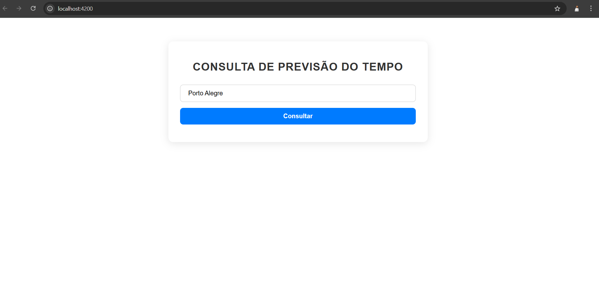
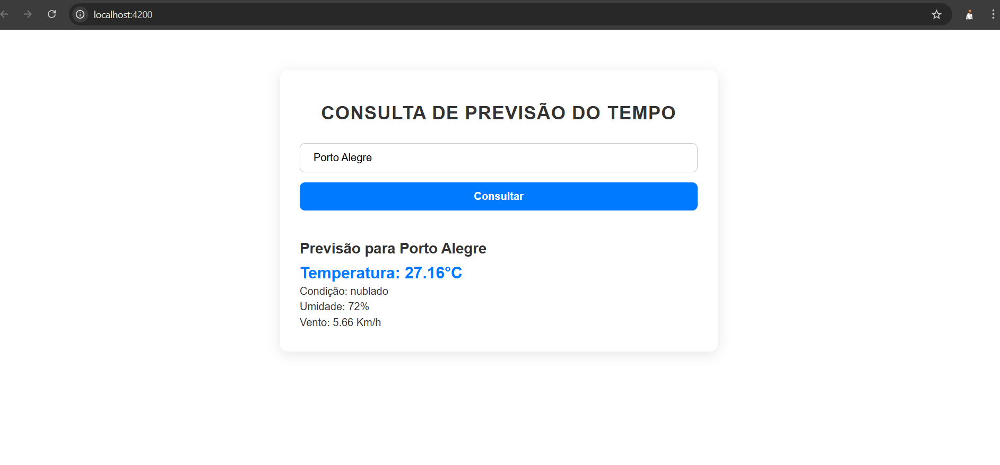
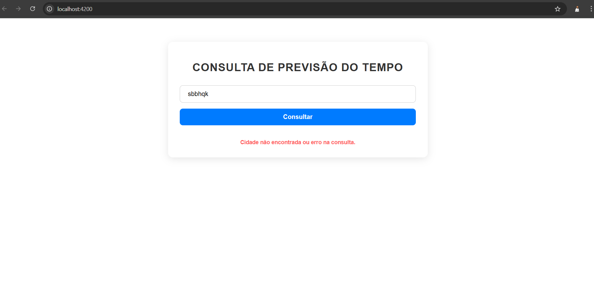

# Projeto Desafio Simfrete Previsão do Tempo

Tecnologias utilizadas

Angular 19
Node 22
TypeScript

## Acessando o projeto

Na raiz do projeto execute ``npm instal`` e após ``ng serve``

O projeto irá subir em :

http://localhost:4200/

## Executando uma consulta

Digite no campo cidade o nome de uma cidade válido:

## Resultado esperado

É esperado os resultado da previsão do tempo da cidade escolhida.

## Resultado com Erro

Resultado cidade não encontrada

